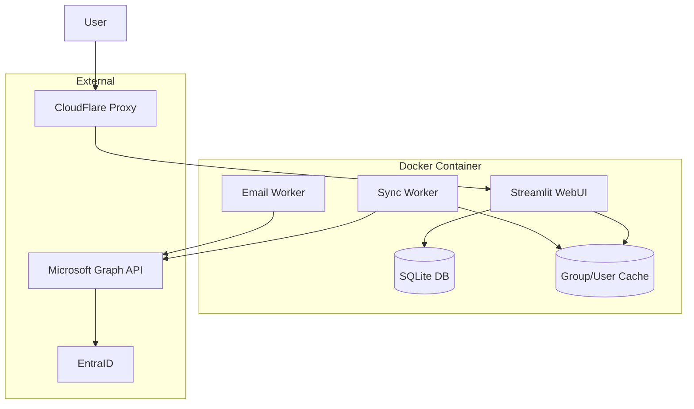

# EntraID Group Email Sender - Project Plan

## Overview
Python-based web application for sending emails to users in selected EntraID groups. Built with Streamlit, Microsoft Graph API, and SQLite.

## Architecture



## Technology Stack
- **Web Framework**: Streamlit (rapid UI development)
- **API Client**: Microsoft Graph API (microsoft-graph-python)
- **Database**: SQLite (simple, embedded)
- **Task Queue**: Python threading + SQLite persistence
- **Container**: Alpine-based Python image (small footprint)

## Project Structure

```
entra-mailer/
├── app.py                 # Main Streamlit application
├── config.py              # Configuration and environment variables
├── db.py                  # SQLite database operations
├── graph_client.py        # Microsoft Graph API client
├── sync_worker.py         # Background group/user sync worker
├── email_worker.py        # Background email sending worker
├── requirements.txt       # Python dependencies
├── Dockerfile             # Docker image definition
├── .env.example           # Environment variables template
└── plans/
    └── plan.md           # This plan
```

## Implementation Steps

### Step 1: Project Setup
- Create project structure
- Set up requirements.txt with dependencies
- Create .env.example with required credentials
- Create Dockerfile based on Alpine Python

### Step 2: Database Layer
- Create SQLite database schema
- Implement models for: groups, users, group_memberships, tasks, email_logs, sync_history
- Add CRUD operations for each model
- Create indexes for efficient querying

### Step 3: Microsoft Graph Client
- Implement authentication using App Registration credentials
- Create functions for:
  - Fetching all groups (with pagination)
  - Getting group members (with pagination)
  - Sending emails (with batch support)
- Implement rate limiting and retry logic

### Step 4: Sync Worker
- Create background thread that runs every hour
- Implement incremental sync strategy
- Track last sync timestamp per group
- Update group membership changes only
- Log sync status and errors
- Handle partial failures gracefully

### Step 5: Email Task Worker
- Create task queue system using SQLite
- Implement batch processing (respect M365 limits)
- Add progress tracking and status updates
- Implement retry mechanism for failed sends
- Run as separate background thread

### Step 6: Streamlit WebUI
- Create login page (basic session tracking)
- Build group search interface using cached data
- Implement template editor (HTML/Rich text)
- Add email preview functionality
- Create task submission and monitoring dashboard
- Display send report with statistics
- Show sync status and last sync timestamp

### Step 7: Docker Configuration
- Optimize Dockerfile for minimal size
- Configure non-root user
- Set up proper volume mounts for SQLite
- Document deployment instructions
- Configure multiple worker threads

## Key Design Decisions

### Sync Worker
- **Frequency**: Runs every hour (configurable via SYNC_INTERVAL_MINUTES)
- **Strategy**: Full initial sync, then incremental updates using delta links
- **Data Stored**: Groups, Users, Group Memberships
- **Performance**: Cached data enables instant group search and filtering
- **Reliability**: Tracks sync state, resumes from last point on failure
- **UI Integration**: Shows last sync time, manual sync trigger option

### Group Selection with Cached Data
- **Instant Search**: Local SQLite queries instead of API calls
- **Filtering**: Filter by group name, description, member count
- **Sorting**: Sort by name, member count, last sync time
- **Pagination**: Efficient pagination through large group lists

### Email Sending Strategy
- **Batch Size**: 50 recipients per email (M365 limit)
- **Rate Limit**: Respect Graph API throttling
- **BCC**: All recipients in BCC field
- **Sender**: Configured via App Registration

### Template Editor
- **Format**: Simple HTML textarea
- **Preview**: Rendered preview in modal
- **Storage**: Save/load templates from SQLite

### Task Tracking
- **Status**: Pending, Processing, Completed, Failed
- **Metrics**: Total, Sent, Failed, Pending
- **Logs**: Individual email send attempts

## Environment Variables Required
```
AZURE_TENANT_ID
AZURE_CLIENT_ID
AZURE_CLIENT_SECRET
SENDER_EMAIL
SENDER_NAME
STREAMLIT_SERVER_PORT
SYNC_INTERVAL_MINUTES     # Default: 60
```

## Docker Deployment
```bash
# Build
docker build -t entra-mailer .

# Run
docker run -d \
  --name entra-mailer \
  -p 8501:8501 \
  --env-file .env \
  -v ./data:/app/data \
  entra-mailer
```

## Security Considerations
- App Registration uses least-privilege permissions
- SQLite database file protected
- No proxy authentication needed (handled by CloudFlare)
- Session tracking for audit purposes

## KISS & YAGNI Compliance
- No authentication library complexity
- No message queue (SQLite is sufficient)
- No caching layer (minimal API calls)
- Simple batch processing
- Basic but functional UI
